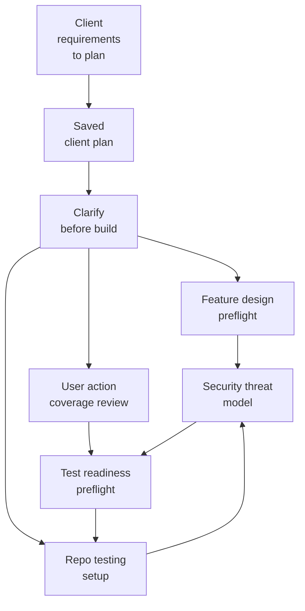
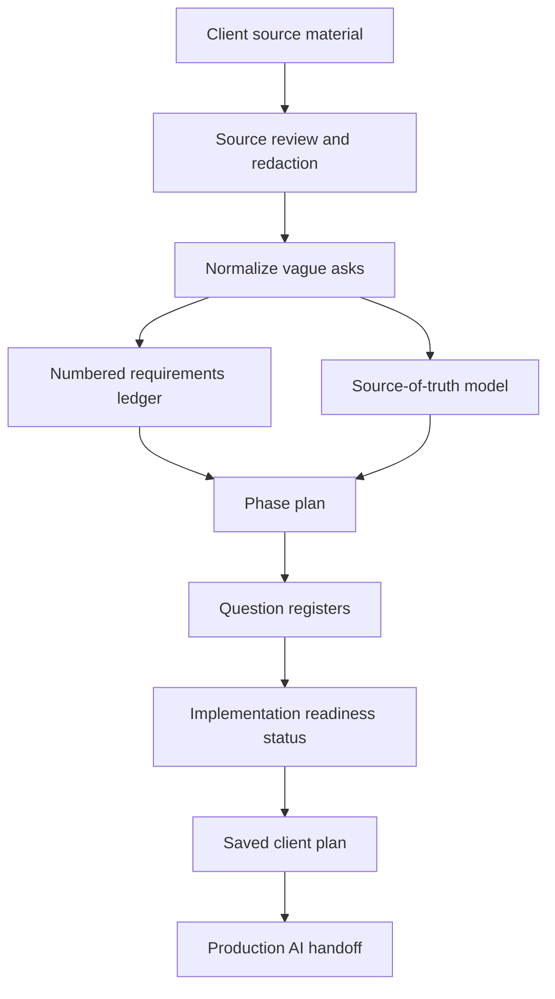

# Client Requirements To Plan Skill Video Breakdown

Draft notes for a Building The Age of AI video about the `client-requirements-to-plan` skill.

## Core Story

The `client-requirements-to-plan` skill turns vague client discovery material into a saved, testable plan.

It does not ask the agent to "write up the requirements" and hope the result is useful. It forces the agent to preserve source evidence, translate vague language into numbered requirements, separate client questions from technical validation work, control scope by phase, and hand the accepted plan into the rest of the Production AI build pipeline.

Video hook:

> The dangerous moment in an AI build is not when the agent writes code. It is when the agent starts building from a vague client sentence and fills the gaps itself.

## 1. What The Skill Does At A High Level

At a high level, the skill:

1. Ingests early client material: notes, transcripts, screenshots, files, spreadsheets, API docs, prior threads, and user clarifications.
2. Treats pasted client material as source of truth unless the user asks for file discovery.
3. Redacts or avoids repeating credential-like source text.
4. Converts vague asks into observable behavior.
5. Creates a stable numbered requirements ledger.
6. Records source evidence for each major requirement.
7. Models source of truth: expected state, actual state, user-entered state, derived state, audit evidence, and output/report.
8. Splits unknowns into technical validation, Phase 1 client questions, later-phase questions, and deferred decisions.
9. Phases the work around risk reduction, with Phase 1 as the smallest useful proof.
10. Saves a Markdown client plan in a client/project folder.
11. Ends with a Production AI handoff into the later planning, design, testing, coverage, and security gates.

Short version for voiceover:

> This skill turns "the client wants automation" into a saved plan another agent can build from without guessing.

## 2. Why It Is Necessary

The failure mode is specific: agents are very good at turning vague client notes into confident-looking plans.

They will invent:

- missing actors,
- hidden requirements,
- full admin portals,
- dashboards,
- notifications,
- storage,
- scheduled jobs,
- production hosting,
- vague acceptance criteria,
- and "client questions" that are really technical validation work.

That creates two bad outcomes.

First, the plan becomes client-facing theatre. It sounds polished, but the requirements are not numbered, not testable, and not traceable to the client source.

Second, the agent overbuilds. A simple proof becomes a platform before the riskiest assumption has been tested.

The skill prevents those failures by forcing the first artifact to answer:

- What did the client actually say?
- Which requirements came from evidence?
- Which requirements are assumptions?
- Which questions must go back to the client?
- Which questions should we validate ourselves?
- What is the smallest proof that demonstrates value?
- What is explicitly not part of Phase 1?
- What build gates must run after the client plan is accepted?

Point for the video:

> Client discovery is not implementation. The first job is to turn vague source material into a plan that is safe to build from.

## 3. Why It Is Part Of Production AI

Production AI is about turning agent work into a proof system.

Most of the existing skills operate after the problem has been shaped:

- `clarify-before-build` confirms the implementation contract.
- `feature-design-preflight` traces a feature through production constraints.
- `repo-testing-setup` creates the validation foundation.
- `user-action-coverage-review` maps user actions to browser and integration proof.
- `security-threat-model` models abuse paths before sensitive work ships.
- `test-readiness-preflight` clears predictable blockers before expensive validation.

The missing upstream step is the client-intake artifact.

`client-requirements-to-plan` belongs in Production AI because it prevents the build pipeline from starting on bad source material. It makes the client plan itself a durable artifact:

- saved to disk,
- reviewable,
- source-backed,
- phase-controlled,
- readiness-labelled,
- and ready to hand into the design/build gates.

Suggested phrasing:

> Production AI starts before the repo exists. If the requirements are vague, every downstream proof gate is proving a guess.

## Skill Overview Visual

Use this as the main visual for where the skill sits in the Production AI graph.

Narration:

> This is not another build gate. It is the upstream intake skill that creates the artifact the build gates consume.

Visual explanation:

1. `client-requirements-to-plan` starts before implementation.
2. It produces the saved client plan: requirements, source evidence, phases, questions, assumptions, risks, proof, and readiness.
3. `clarify-before-build` uses that accepted plan to confirm the implementation contract.
4. `feature-design-preflight` checks whether the proposed features survive real production constraints.
5. `user-action-coverage-review`, `repo-testing-setup`, `security-threat-model`, and `test-readiness-preflight` turn that contract into proof obligations.

Short on-screen label:

> Client notes -> saved plan -> confirmed contract -> design proof -> test/security gates

## Components Provided By The Skill

| Component | What it provides | How it connects |
|---|---|---|
| Skill trigger and description | Routes client briefs, discovery notes, transcripts, and proposal requests into the intake workflow | Activates before `clarify-before-build` when the work is not yet implementation-ready |
| Core rules | Source-of-truth, redaction, scope control, question separation, and no-build-from-draft constraints | Sets the safety contract for the whole planning artifact |
| Source gathering workflow | Lists source types and requires unavailable evidence to be named | Prevents the agent from inventing missing context |
| Brief normalization | Converts vague asks into actor, trigger, input, behavior, output, success, failure, owner, and proof | Turns client language into testable delivery language |
| Requirements ledger | Stable numbered requirements with source evidence, phase, type, acceptance criteria, proof, and status | Becomes the main reference for proposal, implementation, and acceptance |
| Source-of-truth model | Classifies expected state, actual state, user-entered state, derived state, audit evidence, and output/report | Prevents hidden assumptions when systems disagree |
| Phase model | Phase 0 discovery, Phase 1 smallest proof, Phase 2 assessment depth, Phase 3 automation/hardening | Controls scope and stops first builds from becoming platforms |
| Question register | Separates technical validation, Phase 1 client questions, later-phase questions, and deferred decisions | Keeps client decisions separate from delivery-team proof work |
| Saved plan template | Required Markdown structure for the client plan | Makes the output durable and reusable across sessions |
| Readiness status | `READY`, `CONDITIONAL`, or `BLOCKED` | Tells the next agent whether the plan can enter the build pipeline |
| Production AI handoff | Names the next skills and why each applies | Connects client planning to the rest of the skill graph |
| Completion blockers | Defines what makes a client plan incomplete | Prevents vague, unsupported, unsaved, or over-scoped plans |

## How The Components Connect

Narration:

1. Start with messy client source material.
2. Review the material and avoid leaking secrets.
3. Translate vague asks into observable behavior.
4. Create numbered requirements with evidence and proof.
5. Decide which source is expected state, actual state, audit evidence, or output.
6. Phase the work so Phase 1 proves value without building the whole platform.
7. Split unknowns by owner.
8. Mark the plan `READY`, `CONDITIONAL`, or `BLOCKED`.
9. Save it as the client reference.
10. Hand it into the build pipeline.

## Bad Plan Versus Good Plan

Bad:

> Build an automated daily check system with reporting and notifications.

Why it is bad:

- No actor.
- No source evidence.
- No input/output model.
- No first proof.
- No acceptance criteria.
- No distinction between client questions and technical validation.
- No clear blocker.
- No scope control.

Better:

> `R-004`: When the operator runs the Phase 1 proof, the system must read the client-provided schedule file, match each schedule row to the corresponding operational record where possible, and write one output row with match status, matched identifier, and reason when the result is unclear. Phase: `Phase 1`. Source evidence: client discovery note and sample workflow. Acceptance criteria: one output row per input row; unmatched and multiple-match cases are explicit; no guessed matches are marked as successful. Proof: parser unit tests, matching integration tests, and output workbook inspection.

The better version names:

- The actor.
- The trigger.
- The input.
- The behavior.
- The output.
- The phase.
- The source evidence.
- The acceptance criteria.
- The proof.
- The uncertainty handling.

## How Other Skills Consume It

`client-requirements-to-plan` is an upstream orchestrator. Other skills do not consume its runtime code; they consume the saved plan it produces.

| Consuming skill | How it uses the saved client plan |
|---|---|
| `clarify-before-build` | Turns the accepted client plan into a confirmed Shared Understanding Contract before implementation starts |
| `feature-design-preflight` | Uses the requirements, source-of-truth model, integrations, and risks to trace features through production constraints |
| `repo-testing-setup` | Uses the phase plan, critical paths, and proof requirements to create or verify the repo validation foundation |
| `user-action-coverage-review` | Uses the users, actors, workflows, and acceptance criteria to map user actions to browser/E2E and integration evidence |
| `security-threat-model` | Uses the source model, data flows, integrations, credentials, and privacy notes to identify security-sensitive scope |
| `test-readiness-preflight` | Uses the proof plan and open blockers before expensive validation runs |
| `full-app-review` | Can compare an existing app against the accepted client plan to find missing or overbuilt behavior |
| `pr-production-gate` | Can use the requirements and proof expectations as review context for whether a candidate change satisfies the intended behavior |

Suggested phrasing:

> This is the skill that gives the rest of the graph something clean to consume. Without it, every later gate is trying to prove a moving target.

## Suggested Video Structure

### 0. Opening

"The dangerous part of AI development is not always the code. Sometimes it is the moment the agent turns a vague client note into a build plan and quietly fills in the missing details."

Show bad prompt:

> The client wants to automate their daily process. Build a plan.

Then show the problem:

- The agent invents scope.
- The agent asks the wrong questions.
- The agent builds a platform instead of a proof.

### 1. What The Skill Does

Explain the one-sentence version:

> It turns messy client discovery material into a saved, numbered, testable client plan.

Walk through:

- source material,
- requirements ledger,
- source-of-truth model,
- question registers,
- phase plan,
- readiness status,
- saved Markdown output,
- Production AI handoff.

### 2. Why The Skill Exists

Explain the two failure modes:

1. Fluffy proposal text.
2. Overbuilt implementation plan.

Then explain the correction:

- Source evidence.
- Stable requirement IDs.
- Acceptance criteria.
- Proof.
- Phase 1 as smallest useful proof.
- Technical validation separated from client questions.

### 3. Why It Belongs In Production AI

Explain that this skill starts before the repo, before the feature design, and before tests.

The key point:

> A proof system only proves the right thing if the requirements are clear enough to prove.

### 4. Component Walkthrough

Walk through:

1. Core rules.
2. Client plan template.
3. Requirement ledger rules.
4. Question register.
5. Readiness status.
6. Production AI handoff.
7. Completion blockers.

### 5. The Flow

Use the mermaid flow:

Source material -> redaction -> normalized asks -> requirements ledger -> source-of-truth model -> phase plan -> question registers -> readiness -> saved plan -> handoff.

### 6. Bad Versus Good Requirement

Use the bad and better examples above.

Explain why "automate this process" is not a requirement.

### 7. How The Rest Of The Graph Uses It

Show the handoff:

`client-requirements-to-plan` -> `clarify-before-build` -> `feature-design-preflight` -> testing/security/coverage gates.

Make the point that this skill is not competing with `clarify-before-build`; it gives it better source material.

### 8. Closing

"If the client plan is vague, the build is already in trouble. This skill makes the first artifact in the engagement something the rest of the AI system can trust."

## Suggested Titles

1. The AI Skill That Turns Client Vibes Into Buildable Requirements
2. Stop Letting AI Guess Your Client Requirements
3. Before AI Builds Anything, Make It Write This Plan
4. The Missing First Step In AI Software Projects
5. How To Turn Vague Client Notes Into A Testable AI Build Plan

## Thumbnail Ideas

Option 1:

- Left side: messy note card saying "automate this"
- Right side: structured plan with `R-001`, `R-002`, `Phase 1`, `BLOCKED`
- Text: `NO MORE GUESSING`

Option 2:

- Agent/cursor hovering over a vague client note
- A red stop sign before "BUILD"
- Text: `PLAN FIRST`

Option 3:

- Pipeline graphic:
  - client notes -> numbered requirements -> build gates
- Text: `FROM VAGUE TO BUILDABLE`

## Demo Outline

Use a sanitized client workflow example:

1. Start with rough client notes:
   - "We need to automate the daily check."
   - "There is a spreadsheet."
   - "The system has the actual status."
   - "Someone needs a report."
2. Show the skill output:
   - source materials reviewed,
   - source-of-truth model,
   - `R-001` to `R-006`,
   - Phase 1 proof,
   - technical validation questions,
   - client questions,
   - `BLOCKED` readiness until sample files/API examples exist.
3. Show the handoff:
   - `clarify-before-build` after acceptance,
   - `feature-design-preflight` for API/file parsing,
   - `repo-testing-setup` for proof foundation,
   - `security-threat-model` for sensitive data and credentials.

## Key Lines To Use

- "The first artifact is not code. It is the plan the code is allowed to follow."
- "If the requirement has no source evidence, it is not confirmed. It is an assumption."
- "Do not ask the client to answer what your technical validation can prove."
- "Phase 1 is not the smallest thing you can build. It is the smallest thing that proves value."
- "Production AI starts before the repository exists."
- "A proof gate cannot save you from proving the wrong requirement."

## Short Description

The `client-requirements-to-plan` skill turns vague client discovery notes into a saved, testable plan. It creates numbered requirements, source evidence, phased delivery, open questions, technical validation work, readiness status, and a handoff into the Production AI build pipeline.
