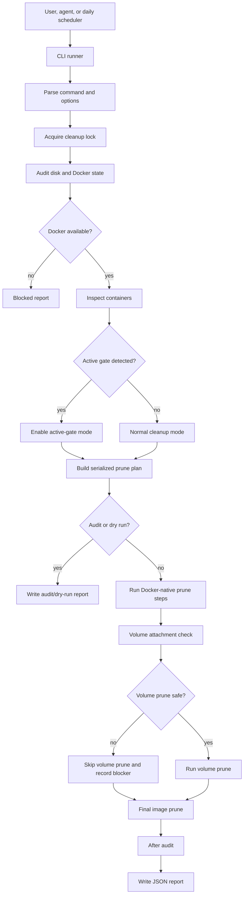

# Docker Disk Cleanup Skill Video Breakdown

Draft notes for a Building The Age of AI video about the `docker-disk-cleanup` skill.

## Core Story

The `docker-disk-cleanup` skill turns Docker cleanup from a risky one-liner into a conservative local operations workflow.

It does not tell the agent to run a broad prune and hope for the best. It forces the agent to audit first, protect active validation work, serialize cleanup, treat volumes carefully, and write a report that explains what happened.

Video hook:

> Everyone knows the command that frees Docker space. The problem is that the same command can also wreck the local state your AI gate still needs.

## 1. What The Skill Does At A High Level

At a high level, the skill:

1. Audits disk and Docker state before deleting anything.
2. Checks whether Docker is available and reports the exact blocker if it is not.
3. Detects active gate-like containers.
4. Switches to active-gate mode when validation work may be running.
5. Builds a serialized Docker-native cleanup plan.
6. Runs container, network, image, builder, and volume cleanup in a controlled order.
7. Uses age filters for image and builder pruning when active gates are present.
8. Checks dangling volumes for container attachment before volume pruning.
9. Writes a JSON report with mode, commands, blockers, skipped steps, and before/after Docker usage.
10. Refuses unsafe cleanup patterns, especially manual deletion of Docker Desktop internals, repo folders, databases, or auth files.

Short version for voiceover:

> This skill lets the agent reclaim Docker disk space without turning cleanup into a production incident on your laptop.

## 2. Why It Is Necessary

The obvious answer to Docker disk pressure is simple:

```bash
docker system prune -a --volumes
```

The problem is that a developer machine or local PR-gate host is not an empty sandbox.

It can contain:

- Active validation containers.
- Fresh images and BuildKit cache needed by a gate.
- Test databases in Docker volumes.
- Local service state.
- Compose networks and volumes shared by current work.
- Reports needed to understand what happened.

The failure mode is not just "Docker ran out of space." It is:

1. Docker fills the disk.
2. The agent runs an aggressive prune.
3. A PR gate, test database, or local service loses state it still needed.
4. The operator cannot tell whether cleanup was a no-op, a partial success, or the cause of the next failure.

This skill exists because disk cleanup is operational work, not housekeeping.

The point for the video:

> The cleanup command is not the skill. The skill is the safety contract around the cleanup command.

## 3. Why It Is Part Of Production AI

Production AI depends on local proof.

The system expects agents to run containerized tests, browser checks, build gates, security scans, and PR validation on the exact candidate state. That means Docker is not incidental infrastructure. Docker is part of the proof machine.

If Docker runs out of space, the gates fail. If cleanup is too aggressive, the gates fail differently.

So `docker-disk-cleanup` is part of Production AI because it keeps the local proof machine healthy without silently destroying the evidence or state the proof machine depends on.

This is why the skill is conservative by design:

- It is Docker-native.
- It is serialized.
- It has a lock.
- It detects active gates.
- It age-filters risky pruning when gates are active.
- It treats volumes as a separate safety problem.
- It writes an operator report.

Production AI is not just "write better code." It is the operational discipline required to keep the agent's proof loops running every day.

## Components Provided By The Skill

| Component | What it provides | How it connects |
|---|---|---|
| Skill trigger and description | Routes Docker disk pressure and cleanup requests into the safe workflow | Activates when the user asks to clean Docker disk usage, reclaim image/build-cache/volume space, run daily cleanup, or diagnose Docker disk pressure |
| Operating rules | Non-negotiable cleanup constraints | Bans `sudo`, manual named-volume deletion, overlapping jobs, secret leakage, and broad cleanup when active gates are detected |
| Quick-start commands | Repeatable audit, dry-run, cleanup, active-gate, and skip-volume commands | Gives the user and agent safe entrypoints before destructive work |
| CLI runner | `scripts/docker-disk-cleanup.mjs` parses arguments and prints operator status | Calls the core cleanup module and returns a concise status/report path |
| Core cleanup module | `scripts/docker-disk-cleanup-core.mjs` contains the planning and execution logic | Owns argument parsing, active-gate detection, prune planning, locking, Docker command execution, volume checks, and report writing |
| Audit stage | Captures filesystem free space, `docker info`, `docker system df`, containers, and volume state | Establishes evidence before cleanup and blocks if Docker is unavailable |
| Active-gate detector | Finds running containers with gate-like names | Switches image and builder cleanup into age-filtered mode |
| Prune planner | Builds the serialized command plan | Ensures cleanup order is predictable and Docker-native |
| Lock directory | Prevents overlapping cleanup runs | Stops two schedules or threads from pruning Docker at the same time |
| Volume attachment check | Looks for dangling volumes still referenced by containers | Blocks volume pruning when metadata suggests risk |
| Report writer | Writes JSON reports with mode, commands, blockers, skipped steps, and audit output | Gives the operator evidence for no-op, blocked, partial, and successful cleanup outcomes |
| Safety policy | Defines allowed and forbidden deletion boundaries | Prevents future adaptations from adding unsafe filesystem deletion |
| Threat model | Models the cleanup automation itself as attack surface | Captures the risks of over-broad cleanup, report leakage, races, and scheduler misuse |
| Focused tests | Tests argument parsing, active-gate detection, prune planning, and volume skip behavior | Proves the safety logic that makes the skill more than instructions |
| Daily automation contract | Defines the scheduled cleanup command and report directory pattern | Lets the skill run once per day without becoming a blind cron job |
| Completion blockers | Defines when the agent cannot call cleanup done | Prevents cleanup without audit, overlapping runs, unsafe volume deletion, missing report details, or secret leakage |

## How The Components Connect



Narration:

1. The user, agent, or daily scheduler starts the CLI.
2. The CLI parses the command: `audit` or `cleanup`, with options like `--dry-run`, `--active-gate-mode`, `--skip-volumes`, `--workspace`, and `--report-dir`.
3. The core module acquires a lock so cleanup cannot overlap with another cleanup.
4. It audits the filesystem and Docker daemon first.
5. If Docker is unavailable, it stops and writes a blocked report.
6. It checks running containers for gate-like names.
7. If active gate work exists, image and builder pruning use an age filter.
8. It builds the prune plan in a fixed order.
9. It treats volumes separately with an attachment check.
10. It writes a report so the operator can tell exactly what happened.

## The Cleanup Order

The serialized cleanup order is:

1. `docker container prune -f`
2. `docker network prune -f`
3. `docker image prune -a ... -f`
4. `docker builder prune -a ... -f`
5. Dangling volume attachment checks
6. `docker volume prune -a -f` when supported, otherwise `docker volume prune -f`
7. Final `docker image prune -a ... -f`

In active-gate mode, image and builder pruning add an age filter, for example:

```bash
docker image prune -a --filter until=1h -f
docker builder prune -a --filter until=1h -f
```

This keeps fresh validation artifacts safer while still reclaiming older Docker debris.

## Bad Cleanup Versus Good Cleanup

Bad:

```bash
docker system prune -a --volumes -f
```

Why it is bad for this context:

- It skips the audit.
- It does not know whether a PR gate is active.
- It treats volume cleanup as just another flag.
- It produces weak operator evidence.
- It encourages the agent to think cleanup is one command rather than a workflow.

Better:

```bash
node ~/.codex/skills/docker-disk-cleanup/scripts/docker-disk-cleanup.mjs audit
node ~/.codex/skills/docker-disk-cleanup/scripts/docker-disk-cleanup.mjs cleanup --dry-run
node ~/.codex/skills/docker-disk-cleanup/scripts/docker-disk-cleanup.mjs cleanup --workspace /path/to/workspace
```

When a gate is active:

```bash
node ~/.codex/skills/docker-disk-cleanup/scripts/docker-disk-cleanup.mjs cleanup --active-gate-mode
```

When volume risk is unclear:

```bash
node ~/.codex/skills/docker-disk-cleanup/scripts/docker-disk-cleanup.mjs cleanup --skip-volumes
```

The better version gives the agent a repeatable path: audit, plan, protect active work, clean only through Docker, and report.

## How Other Skills And Systems Consume It

This skill has a different graph role than `security-threat-model`.

`security-threat-model` is a specialist gate that many other skills call directly. `docker-disk-cleanup` is mostly an operational leaf: it keeps the local proof environment healthy so other gates can keep running.

That distinction matters for the video. Do not present Docker cleanup as an orchestrator. Present it as local infrastructure maintenance for the proof system.

| Consumer | How it uses or depends on `docker-disk-cleanup` |
|---|---|
| Daily automation | Runs the cleanup command on a schedule with a report directory, making disk recovery routine instead of emergency-only |
| Human/operator | Uses the audit, dry-run, cleanup, active-gate, and skip-volume commands when Docker disk pressure appears |
| `pr-production-gate` | Depends indirectly on Docker capacity and fresh validation artifacts; Docker cleanup must not destroy active gate work |
| `repo-testing-setup` | Establishes containerized proof lanes; Docker cleanup helps keep those lanes runnable over time |
| `test-readiness-preflight` | Can treat Docker disk pressure as a readiness blocker and route the operator toward safe cleanup before expensive gates |
| `laptop-currency-maintenance` | Sits beside this as another local maintenance skill, but with a different boundary: it handles host tool currency, while Docker cleanup only reclaims Docker-managed resources |
| `security-threat-model` | Reviews the cleanup automation when cleanup behavior, report sinks, scheduler integration, or destructive boundaries change |
| `full-app-review` | Depends indirectly when reviewing whether a repo can be validated locally in containers without infrastructure blockers |

Suggested phrasing:

> This skill is consumed by the Production AI system as infrastructure hygiene. It is not there to make the app safer directly. It is there so the proof gates do not fail because the local Docker host is full, and so cleanup does not become the thing that breaks the proof gates.

## Suggested Video Structure

### 0. Opening

"The fastest way to fix Docker disk pressure is also one of the fastest ways to break your local AI development system."

Show the bad command:

```bash
docker system prune -a --volumes -f
```

Then explain:

> That command is not always wrong. But inside a local PR-gate machine, it is not enough of a safety model.

### 1. What The Skill Does

Explain that this is a conservative Docker-native cleanup workflow.

Use the one-sentence version:

> It reclaims Docker disk space while preserving active services, test databases, and PR-gate work.

### 2. Why It Exists

Explain the real failure:

- Docker fills up.
- The agent runs broad cleanup.
- Active validation loses images, cache, containers, or volumes.
- The next failure looks like a test problem, but it was caused by cleanup.

Then name the inversion:

> Cleanup needs evidence and safety rails, just like testing and deployment.

### 3. The Production AI Role

Explain that Production AI relies on local containerized proof.

Docker is part of that proof system. If Docker is unhealthy, the proof system is unhealthy.

This skill keeps Docker healthy without violating the local-first validation contract.

### 4. Component Walkthrough

Walk through:

1. Operating rules.
2. CLI runner.
3. Core cleanup module.
4. Audit stage.
5. Lock.
6. Active-gate detector.
7. Prune planner.
8. Volume attachment check.
9. Report writer.
10. Safety policy.
11. Threat model.
12. Focused tests.
13. Daily automation contract.
14. Completion blockers.

### 5. How Cleanup Gets Built

Use the flow:

User or scheduler -> CLI -> lock -> audit -> Docker availability -> active-gate detection -> prune plan -> volume check -> cleanup -> after audit -> report.

### 6. How Other Skills Use It

Explain the difference between direct and indirect consumption:

- It is not a central orchestrator.
- It does not replace the PR gate, test preflight, or repo testing setup.
- It keeps the environment those skills rely on from failing due to disk pressure.

Examples:

- A PR gate is active, so cleanup switches to age-filtered image and builder pruning.
- A repo testing setup needs Docker to stay healthy across repeated validation runs.
- A test readiness preflight can identify Docker disk pressure as a blocker before launching a full gate.
- A daily scheduler keeps cleanup routine instead of emergency-only.

### 7. Closing

Closing line:

> The point is not to teach the agent a Docker prune command. The point is to teach it the operating discipline around that command.

## Possible Title Options

- My Docker Cleanup Has A Safety Contract
- Stop Letting AI Run Dangerous Docker Prunes
- The Docker Cleanup Skill That Protects My PR Gate
- Daily Docker Cleanup Without Breaking Active Work
- Docker Disk Cleanup For AI Coding Agents

## Possible Thumbnail Text

- DOCKER PRUNE CAN BREAK YOU
- SAFE AI DOCKER CLEANUP
- CLEANUP NEEDS A CONTRACT
- DON'T NUKE YOUR PR GATE
- DOCKER CLEANUP, BUT SAFE

## Notes For Later

- Show `docker system df` as the audit anchor.
- Show the active-gate mode as the key differentiator.
- Show volume pruning as the scary bit: it is allowed only through Docker and only after checks.
- Show the JSON report as the operator contract.
- Mention that this is scheduled daily, which is why the lock and report are important.
- Avoid making it sound like the skill can save arbitrary manually named volumes. Its safety boundary is conservative Docker-native cleanup, not magical state recovery.
- Consider contrasting `docker system prune -a --volumes -f` with the safer audit/dry-run/cleanup sequence.
