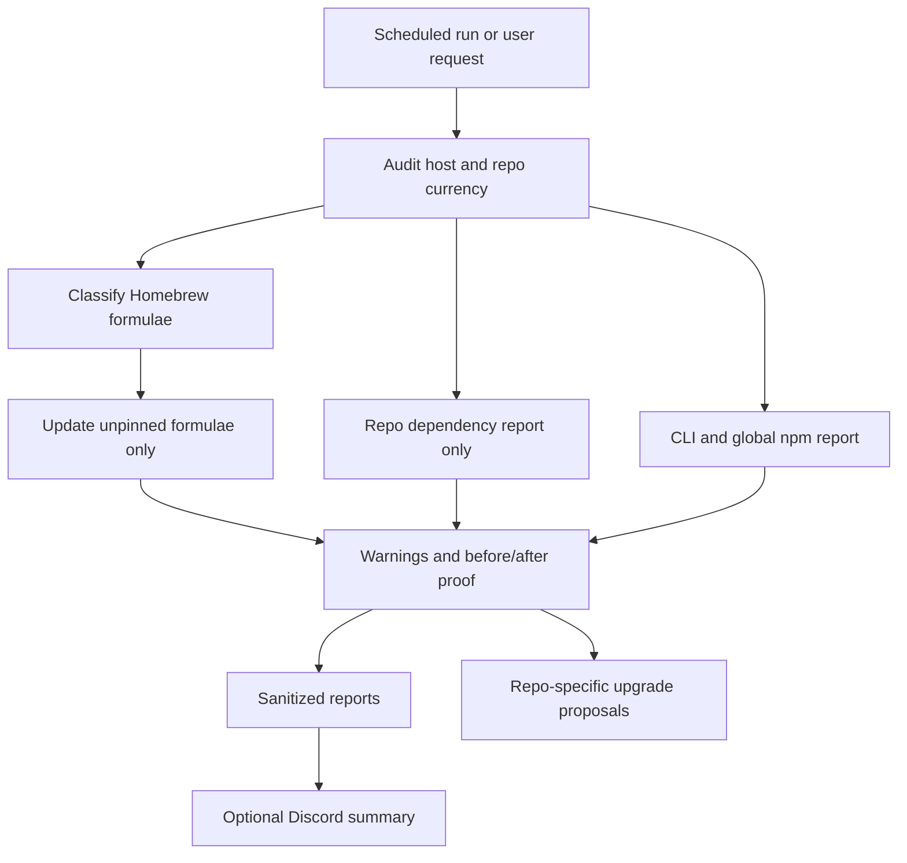

# Laptop Currency Maintenance Skill Video Breakdown

Draft notes for a Building The Age of AI video about the `laptop-currency-maintenance` skill.

## Core Story

The `laptop-currency-maintenance` skill turns "keep my machine up to date" into a conservative local operations workflow.

It does not let the agent upgrade everything it can find. It audits first, updates only unpinned Homebrew formulae, keeps repos report-only, highlights high-impact tooling drift, redacts report output, and escalates repo dependency upgrades into separate repo-specific work.

Video hook:

> The agent that keeps your laptop current also has enough access to break your development environment. This skill gives that automation a strict do-not-touch list.

## 1. What The Skill Does At A High Level

At a high level, the skill:

1. Audits Homebrew formulae, Homebrew casks, global npm packages, CLI versions, and repo dependency drift.
2. Classifies Homebrew formulae as auto-upgradeable or pinned.
3. Auto-updates only unpinned Homebrew formulae.
4. Keeps casks, macOS updates, App Store apps, Docker Desktop, global npm packages, language runtime managers, repo manifests, and lockfiles out of the auto-update path.
5. Reports stale repo dependencies without mutating repos.
6. Flags dirty or active repos so recommendations do not ignore current work.
7. Highlights configured high-impact formulae when they are outdated.
8. Redacts secrets, provider IDs, emails, and local home paths from report text.
9. Writes local JSON and Markdown reports.
10. Optionally posts a sanitized Discord summary and report attachment.
11. Fails closed when Homebrew update/upgrade safety checks fail.

Short version for voiceover:

> This skill keeps the proof machine current without letting maintenance become a surprise migration.

## 2. Why It Is Necessary

Developer-machine drift can look like code failure:

- old CLIs do not support current API fields,
- stale package managers misunderstand lockfiles,
- security scanners miss new rules,
- deployment tools change flags,
- local tests fail because the runtime is behind production.

But fully automated updates create the opposite failure:

- Docker Desktop updates in the middle of local gate work,
- a cask forces a restart,
- a major runtime changes behavior,
- repo lockfiles move without focused tests,
- a global package update breaks a script,
- the operator cannot tell what changed.

The skill exists because "update everything" is not a safe maintenance policy.

Point for the video:

> Currency is useful only if the boundary is clear. This skill updates the host tooling lane and refuses to silently become repo maintenance.

## 3. Why It Is Part Of Production AI

Production AI depends on local proof:

- containerized tests,
- browser checks,
- security scans,
- dependency audits,
- local PR gates,
- deployment tooling,
- report generation.

All of that depends on host tooling being current enough to run the proof. At the same time, the proof system depends on repo state not being mutated by unrelated maintenance.

`laptop-currency-maintenance` is part of Production AI because it keeps the local proof environment current while preserving the boundary between:

- host tool maintenance, and
- repo implementation work.

Suggested phrasing:

> The laptop is part of the AI system. If it drifts, the proof gates become unreliable. If maintenance mutates too much, the proof gates become meaningless.

## Components Provided By The Skill

| Component | What it provides | How it connects |
|---|---|---|
| Skill trigger and description | Routes host-tooling currency and package drift requests into a safe workflow | Activates when the user asks to update Homebrew, CLIs, global tooling, or audit dependency currency |
| Operating rules | Do-not-touch list, audit-first rule, no sudo, repo report-only boundary | Prevents broad maintenance from becoming a destructive upgrade |
| CLI runner | `scripts/laptop-currency-maintenance.mjs` with `audit`, `update`, `--dry-run`, `--no-discord`, and `--config` | Gives the skill a repeatable command surface |
| Core module | Homebrew classification, repo scan, CLI version checks, report generation, Discord posting, sanitizer | Implements the safety policy in code |
| Config example | Absolute-path config with Discord disabled by default | Makes public setup inert until the user opts in |
| High-impact formula list | Highlights especially important stale formulae | Helps the operator notice changes to critical CLIs such as Node, GitHub CLI, or scanners |
| Warning aggregation | Marks partial audit failures as `completed_with_warnings` | Stops failed checks from hiding inside a successful-looking report |
| Redaction layer | Redacts tokens, emails, provider IDs, secret-shaped values, and local home paths | Keeps reports safe for chat summaries and review |
| Focused tests | Proves classification, redaction, dry-run behavior, repo report-only behavior, fail-closed Homebrew behavior, and warning status | Makes the safety contract testable |
| Threat model | Treats the automation itself as attack surface | Records risks around bot tokens, over-broad updates, repo mutation, and report leakage |
| Automation template | Provides an inert scheduled-run example | Lets users schedule the skill without copying private machine paths |

## Skill Overview Visual



Narration:

1. The user or schedule starts the maintenance pass.
2. The tool audits first.
3. Homebrew formulae are the only auto-update lane.
4. Repo dependencies become proposals, not mutations.
5. Warnings and before/after proof go into local reports.
6. Sanitized output can be posted to Discord.
7. Real repo upgrades start a separate validated task.

## Bad Maintenance Versus Good Maintenance

Bad:

> Update Homebrew, npm globals, Docker Desktop, repo packages, and lockfiles every morning.

Why it is bad:

- It crosses host and repo boundaries.
- It can mutate active work.
- It can require restarts.
- It makes failures hard to attribute.
- It turns maintenance into an unreviewed implementation task.

Better:

```bash
node ~/.codex/skills/laptop-currency-maintenance/scripts/laptop-currency-maintenance.mjs audit
node ~/.codex/skills/laptop-currency-maintenance/scripts/laptop-currency-maintenance.mjs update --dry-run
node ~/.codex/skills/laptop-currency-maintenance/scripts/laptop-currency-maintenance.mjs update
```

The better version audits first, updates only unpinned Homebrew formulae, reports everything else, and gives repo upgrades their own validation path.

## How Other Skills Consume It

| Consumer | How it uses or depends on `laptop-currency-maintenance` |
|---|---|
| `test-readiness-preflight` | Can treat stale or missing host tooling as a validation-readiness blocker |
| `repo-testing-setup` | Depends on current enough host tooling to orchestrate containerized local proof |
| `pr-production-gate` | Depends indirectly on current CLIs, scanners, Docker orchestration, and GitHub tooling |
| `security-threat-model` | Reviews this automation when report sinks, scheduler behavior, token handling, or destructive boundaries change |
| `docker-disk-cleanup` | Sits beside it as operational maintenance, but handles Docker disk pressure rather than package currency |
| Repo-specific upgrade tasks | Start separately when this skill reports dependency drift in a repo |

Suggested phrasing:

> This skill does not make repo upgrades safe by doing them automatically. It makes them visible, then routes them into the normal Production AI proof system.

## Suggested Video Structure

### 0. Opening

"Your AI agent can update your laptop every day. The question is: what is it absolutely not allowed to touch?"

Show the bad version:

> update everything

Then show the strict boundary:

> Homebrew formulae only. Repos report-only.

### 1. What The Skill Does

Explain the audit-first maintenance pass:

- Homebrew formulae,
- casks report-only,
- global npm report-only,
- repo dependency audit report-only,
- CLI versions,
- sanitized reports,
- optional Discord summary.

### 2. Why It Exists

Explain the two risks:

1. Stale tooling breaks proof.
2. Over-broad updates break the workstation or mutate repos.

### 3. The Production AI Role

Connect it to local proof:

- tests,
- scans,
- gates,
- deploy tooling,
- repo upgrade escalation.

### 4. Component Walkthrough

Walk through:

1. `SKILL.md` operating rules.
2. CLI runner.
3. Core module.
4. Config example.
5. Threat model.
6. Focused tests.
7. Automation template.

### 5. Safety Contract

Emphasize:

- no sudo,
- no casks,
- no repo mutation,
- no global npm mutation,
- no Docker Desktop,
- no macOS/App Store updates,
- fail closed on Homebrew update failures,
- report warnings explicitly.

### 6. Closing

"Maintenance is not boring when it runs automatically. The do-not-touch list is the product."

## Suggested Titles

1. I Let My AI Agent Update My Laptop Every Day - With A Strict Do-Not-Touch List
2. The Safe Way To Let AI Maintain Your Developer Machine
3. Stop Letting Tool Drift Break Your AI Coding Gates
4. My AI Updates Homebrew, But It Is Banned From Touching My Repos
5. The Laptop Maintenance Skill Behind Production AI

## Thumbnail Ideas

Option 1:

- Big text: `DO NOT TOUCH`
- Background: checklist with `Homebrew formulae` checked and `repos`, `Docker Desktop`, `casks` crossed out.

Option 2:

- Split screen:
  - left: "update everything" with red warning icons,
  - right: "audit first" with green report.

Option 3:

- Pipeline:
  - audit -> formula update -> report -> repo upgrade proposal
- Text: `SAFE DAILY UPDATES`

## Key Lines To Use

- "The laptop is part of the AI system."
- "Update drift breaks proof, but over-broad maintenance breaks trust."
- "Repos are report-only territory."
- "The do-not-touch list is the product."
- "A daily automation with a bot token is attack surface."
- "This skill keeps tooling current without turning maintenance into implementation."

## Short Description

The `laptop-currency-maintenance` skill keeps developer tooling current with an audit-first, fail-closed safety contract. It updates only unpinned Homebrew formulae, keeps repos report-only, highlights high-impact stale tools, redacts reports, and routes repo upgrades into separate validated work.
