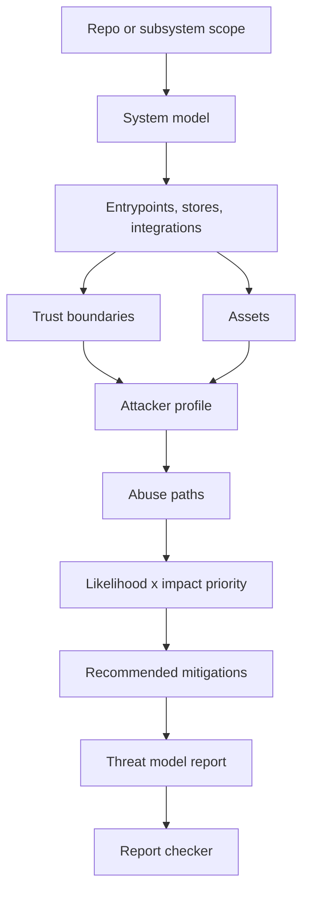

# Security Threat Model Skill Video Breakdown

Draft notes for a Building The Age of AI video about the `security-threat-model` skill.

## Core Story

The `security-threat-model` skill turns "do a security review" into a repo-grounded threat model.

It does not ask the agent to list generic risks. It forces the agent to inspect the actual system, map real entrypoints, identify trust boundaries and assets, calibrate a realistic attacker, trace abuse paths, rank them, and write a structured report.

Video hook:

> Most AI security reviews are either checklist theatre or panic fiction. This skill makes the agent prove every threat against the code that actually exists.

## 1. What The Skill Does At A High Level

At a high level, the skill:

1. Reads the repo, subsystem, or automation in scope.
2. Builds a system model from real files.
3. Separates runtime, CI/build, and dev/test surfaces.
4. Identifies trust boundaries and risk-driving assets.
5. Defines attacker capabilities and non-capabilities.
6. Traces concrete abuse paths: entrypoint -> boundary -> asset -> impact.
7. Ranks each path by likelihood and impact.
8. Records assumptions instead of pretending unknowns are facts.
9. Writes `<target>-threat-model.md`.
10. Runs a report checker so the output has the required structure.

Short version for voiceover:

> This skill makes the agent produce a threat model that a developer can trace back to the code and a security reviewer can trace back to actual attack paths.

## 2. Why It Is Necessary

The failure mode is specific: agents are good at producing security-shaped text.

They will say things like:

- Validate inputs.
- Add authentication.
- Sanitize data.
- Follow OWASP.
- Add logging.

Those statements sound reasonable, but they often do not answer the questions that matter:

- Which entrypoint is exposed?
- Which trust boundary is crossed?
- What asset is at risk?
- What existing control was found?
- What control is missing?
- How likely is the abuse path?
- How bad is the impact?
- Where exactly should the mitigation attach?

The skill prevents two opposite failures:

1. Generic boilerplate: security advice with no path back to the code.
2. Inflated paranoia: imaginary attackers with unlimited access, creating fake critical findings.

The point for the video:

> A finding only counts if it can name the entrypoint, boundary, asset, existing control, missing control, likelihood, impact, and mitigation location.

## 3. Why It Is Part Of Production AI

Production AI is about changing "done" from "the agent says it works" to "the agent produced proof."

Security belongs inside that proof system:

- Tests prove behavior.
- Browser checks prove user flows.
- Secret scans prove no obvious credential leak.
- Dependency audits prove known package risk has been checked.
- Threat modeling proves the agent considered how the system can be abused.

The `security-threat-model` skill is the security gate in the Production AI graph.

It makes security review:

- Reusable.
- Structured.
- Evidence-grounded.
- Consumable by other skills.
- Hard to satisfy with vague advice.

Production AI needs this because agent-built systems can move faster than human review habits. If the agent can create routes, upload flows, webhook handlers, background jobs, CI/CD config, and deploy automation, then the agent also needs a structured way to model the abuse paths it just created.

## Components Provided By The Skill

| Component | What it provides | How it connects |
|---|---|---|
| Skill trigger and description | Routes security-sensitive work into the skill | Other skills invoke it when auth, uploads, payments, secrets, CI/CD, deployment, logs, or data boundaries are touched |
| Operating rules | Quality bar for evidence, confidence tags, attacker calibration, and no secret leakage | Constrains the whole workflow |
| Workflow | Step-by-step threat-model pipeline | Turns repo inspection into a written threat model |
| Surface checklists | Prompts for web apps, agents, LLM/tool systems, CI/CD, provider tokens, file/media, and scheduled jobs | Helps the agent avoid missing common attack surfaces |
| Boundaries/assets/controls reference | Vocabulary for trust boundaries, assets, and mitigation types | Converts repo facts into a security model |
| Abuse-path taxonomy | Closed categories: access, exfiltration, integrity, execution, availability, detection-evasion | Keeps findings consistent and reviewable |
| Report contract | Required structure for `<target>-threat-model.md` | Makes the output machine-checkable and human-reviewable |
| Example report | Shows evidence density and expected shape | Prevents vague or overlong reports |
| Report checker script | Validates required headings, AP rows, assumptions, boundaries, and mitigations | Gives the skill a proof step before delivery |
| Completion blockers | Defines when the agent is not allowed to call the threat model done | Prevents checklist dumps and unsupported priorities |
| Headless mode | Allows use inside PR gates and automations | Records `unvalidated` assumptions instead of blocking forever |

## How The Components Connect

Narration:

1. Start with the target: the whole repo, a route, a worker, a PR gate, or an automation.
2. Build the system model from files, not from memory.
3. Find the entrypoints: routes, webhooks, uploads, jobs, CLI commands, provider callbacks, CI scripts.
4. Find the trust boundaries: anonymous user to route, tenant to tenant, app to database, PR author to CI runner, automation to deploy token.
5. Identify the assets: secrets, user data, tenant state, deploy credentials, audit logs, compute quota.
6. Define the attacker: what they can do and what they cannot do.
7. Trace abuse paths through the boundaries to the assets.
8. Rank the paths by likelihood and impact.
9. Recommend concrete mitigations tied to locations.
10. Check that the report has the required structure.

## Bad Finding Versus Good Abuse Path

Bad:

> Validate webhook inputs.

Better:

> `AP-1`: Replay a valid provider event through `POST /api/webhooks/payments` -> webhook boundary without event-id idempotency -> invoice payment state. Class: `integrity`. Likelihood: `medium` because the route is public and replay storage was not found. Impact: `high` because duplicate state transitions can corrupt billing. Mitigation: persist processed provider event IDs before invoice mutation.

The better version names:

- The entrypoint.
- The trust boundary.
- The asset.
- The abuse class.
- The likelihood.
- The impact.
- The evidence gap.
- The mitigation location.

## How Other Skills Consume It

This is the Production AI angle: `security-threat-model` is not isolated. It is the security escalation point for the rest of the graph.

| Consuming skill | How it uses `security-threat-model` |
|---|---|
| `clarify-before-build` | Pulls it into plans that touch auth, user data, tenant boundaries, payments, secrets, uploads, deployment, CI/CD, or integrations |
| `feature-design-preflight` | Uses it when a design has security-sensitive architecture or data-flow risk |
| `test-readiness-preflight` | Requires it before push/readiness when changed scope is security-sensitive |
| `full-app-review` | Uses it as the security dimension inside a whole-app audit |
| `codebase-prune-review` | Uses it when removals affect auth, uploads, parsers, webhooks, provider clients, storage, payments, or deployment |
| `error-logging-instrumentation` | Uses it because logs can leak sensitive data or hide important failures |
| `pr-production-gate` | Consumes it as a fail-closed gate before approving or deploying changed scope |
| `repo-testing-setup` | Uses it because hooks, security scanners, CI/CD, and validation gates are themselves attack surface |
| `pr-gate-adoption` | Uses it because branch protections, deploy automation, provider settings, and hook installation change the trust model |
| `nextjs-vercel-analytics` | Uses it for analytics payload/privacy review before push-readiness |
| `laptop-currency-maintenance` | Escalates repo dependency upgrade work into threat modeling when push/readiness or sensitive dependencies are in scope |

## Suggested Video Structure

### 0. Opening

"Most AI-generated security reviews look convincing and prove almost nothing."

Show the bad finding:

> Validate inputs.

Then show the better abuse path with entrypoint, boundary, asset, likelihood, impact, and mitigation.

### 1. What The Skill Does

Explain that this skill writes an evidence-grounded threat model for a repo, subsystem, or automation.

Use the one-sentence version:

> It forces the agent to move from security advice to traced abuse paths.

### 2. Why It Exists

Explain the two failures:

- Checklist theatre.
- Panic fiction.

Then explain the fix:

- Evidence tags.
- Real attackers.
- Non-capabilities.
- Traceable boundaries.
- Few findings, fully justified.

### 3. The Production AI Role

Explain that Production AI is a graph of proof gates.

Security is not a vibe. It is a gate.

This skill is where security-sensitive work gets routed.

### 4. Component Walkthrough

Walk through:

1. Operating rules.
2. Workflow.
3. Surface checklists.
4. Boundaries/assets/controls reference.
5. Abuse-path taxonomy.
6. Report contract.
7. Example report.
8. Checker script.
9. Completion blockers.
10. Headless mode.

### 5. How The Report Gets Built

Use the flow:

Scope -> system model -> entrypoints -> boundaries/assets -> attacker profile -> abuse paths -> priority -> mitigations -> report -> checker.

### 6. How Other Skills Use It

Show it as the security escalation point.

Examples:

- Planning a payment feature? `clarify-before-build` routes to threat modeling.
- Adding uploads? `feature-design-preflight` routes to threat modeling.
- Preparing to push? `test-readiness-preflight` checks if threat modeling is needed.
- Running the PR gate? `pr-production-gate` fails closed on unresolved critical/high security findings.
- Fixing logs? `error-logging-instrumentation` threat-models privacy leakage.

### 7. Closing

Closing line:

> The point is not to make the agent "think about security." The point is to make security a gate with evidence, structure, and failure conditions.

## Possible Title Options

- Threat Models That Are Not Checklist Dumps
- Make Your AI Agent Prove The Security Review
- Stop Letting AI Write Fake Security Reviews
- The Security Gate In My Production AI Skill System
- How To Make AI Threat Models Trace Back To Code

## Possible Thumbnail Text

- SECURITY REVIEW != SECURITY
- MAKE AI PROVE THE THREAT
- NO MORE FAKE THREAT MODELS
- TRACE THE ATTACK PATH

## Notes For Later

- Consider showing the `security-threat-model` skill graph connections on screen.
- Consider showing the checker script as the "proof that the proof has structure."
- Consider using a webhook replay example because it is concrete and easy to understand.
- Avoid turning this into a general threat modeling tutorial; keep it about why the skill exists and how it fits Production AI.
