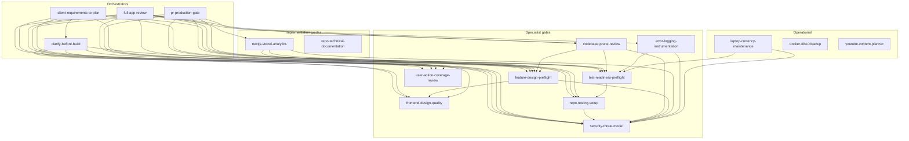

# The skill graph

These skills are not a flat menu — they form a graph. Skills name other skills with the `$skill-name` convention, and the references are contractual: an orchestrator is not allowed to call its own work complete until the specialist skills it invoked have their requirements represented in the output.

## Three layers

- **Orchestrators** own a whole engagement or major engagement stage: a client intake plan (`client-requirements-to-plan`), a planning conversation (`clarify-before-build`), a whole-app audit (`full-app-review`), a review-to-deploy pipeline (`pr-production-gate`). They sequence specialists.
- **Specialist gates** own one dimension — design risk, frontend quality, validation readiness, coverage, removal safety, observability, security — and define what "covered" means for it.
- **Implementation guides** are domain-specific build recipes that themselves invoke the gates (`nextjs-vercel-analytics` requires a design preflight for nontrivial funnels and a threat-model pass before push).
- **Operational/content workflows** keep the system usable around the core proof loop: local maintenance, Docker cleanup, and content artifacts.

## Composition rules

The graph works because the references carry obligations, not suggestions:

1. **Applicability is checked, not assumed.** `clarify-before-build` lists the conditions under which each specialist applies ("when the plan touches frontend UI…", "when the plan touches auth/authz, user data, tenant boundaries…"). The agent evaluates the conditions every time.
2. **No silent skips.** `full-app-review` requires every dimension to be `covered` or explicitly `not applicable` with a reason. A skipped dimension with no reason is an incomplete review by definition.
3. **Requirements flow upward.** When a specialist applies, the orchestrator's exit gate inherits it: "do not finish the Shared Understanding Contract until its relevant design requirements are represented in acceptance criteria, risks, and verification."
4. **Specialists stay in their lane.** `user-action-coverage-review` explicitly defers whole-app audits to `$full-app-review`; the documentation skill defers findings-and-fixes to the review skill. Boundary statements prevent two skills from half-doing the same job.
5. **Escalation is part of the contract.** Cheap skills name the expensive skill to escalate to (`laptop-currency-maintenance` audits escalate repo upgrades to repo-specific work with `$test-readiness-preflight`), so scope creep gets routed instead of absorbed.

## Why a graph beats a mega-skill

The alternative — one giant "do everything right" skill — fails in both directions: it is too big to load on every task, and too vague to enforce anything. The graph gets you:

- **Cheap routing.** Only the trigger descriptions are always in context; bodies load when a situation matches.
- **Independent evolution.** Tightening the coverage gate does not risk the planning gate.
- **Honest coverage accounting.** An orchestrator's "skill coverage matrix" (applied / skipped / blocked per specialist) is only possible when the specialists are discrete units.

## Porting note

The `$skill-name` syntax is Codex CLI convention. In Claude Code, the same graph works with skills referencing each other by name in prose ("use the test-readiness-preflight skill before the full gate") or via explicit Skill invocations — the structure and obligations are what matter, not the sigil.
