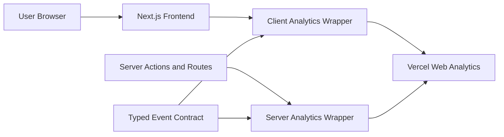

# Next.js Vercel Analytics Skill Threat Model

## Executive summary

The main risks are accidental sensitive-data leakage through custom analytics payloads, misleading event semantics from double-counting or premature server events, and product-flow breakage if analytics failures are allowed to throw. The skill mitigates these by requiring typed wrappers, strict no-PII property rules, payload sanitizer tests, security review, and clear separation between frontend intent events and backend authoritative outcome events.

## Scope and assumptions

- In scope: `SKILL.md` and references under `~/.codex/skills/nextjs-vercel-analytics`.
- Out of scope: Vercel platform internals, dashboards, OpenTelemetry, Speed Insights, runtime log drains, and specific app repos that later use the skill.
- Assumption: downstream repos are Next.js apps deployed to Vercel or intended to use Vercel Web Analytics.
- Assumption: strict no-PII is the default privacy posture unless the user explicitly approves a repo-specific exception after security review.
- Open question: whether each target Vercel project is on a plan that supports custom events.

## System model

### Primary components

- Skill instructions guiding Codex through repo inspection, package installation, pageview setup, typed client/server wrappers, and verification.
- Reference files defining event contracts, privacy rules, and validation requirements.
- Target Next.js apps that later import `@vercel/analytics` and send pageviews/custom events to Vercel.

### Data flows and trust boundaries

- User/browser -> Next.js frontend: user interactions trigger client events with coarse metadata.
- Next.js server -> Vercel Analytics: server actions or route handlers emit authoritative outcome events.
- Repo code -> Vercel package: typed wrappers call `track()` from client or server imports.
- Developer/Codex -> repo code: instrumentation decisions cross from natural-language request into production analytics payload design.

#### Diagram

## Assets and security objectives

| Asset | Why it matters | Security objective |
| --- | --- | --- |
| User and tenant data | Analytics payloads can accidentally expose sensitive data | Confidentiality |
| Event taxonomy | Drives product decisions and funnels | Integrity |
| Product flows | Analytics must not break signup, purchase, upload, or admin flows | Availability |
| Repo source and tests | Enforce privacy and event consistency | Integrity |

## Attacker model

### Capabilities

- A user can enter sensitive text into forms, URLs, uploads, and profile fields that developers might accidentally pass to analytics.
- A developer or agent can mistakenly pass raw objects, errors, request bodies, or search params to `track()`.
- A malicious user may craft values that look harmless but contain tokens, emails, or tracking identifiers.

### Non-capabilities

- The skill does not grant access to Vercel dashboards or analytics data.
- The skill does not create third-party drains or external telemetry destinations.
- The skill does not store analytics data locally.

## Threat model table

| Threat ID | Threat source | Prerequisites | Threat action | Impact | Existing controls | Gaps | Recommended mitigations | Likelihood | Impact | Priority |
| --- | --- | --- | --- | --- | --- | --- | --- | --- | --- | --- |
| TM-001 | Developer or agent error | Instrumentation passes raw user/form/request data | Send PII or secrets to Vercel custom events | Sensitive data exposure | Strict no-PII rules, typed properties, sanitizer tests | Downstream repos must implement controls correctly | Require wrapper-only tracking and tests for sensitive keys/values | Medium | High | High |
| TM-002 | Product instrumentation mistake | Frontend and backend both track same outcome | Double-count business events | Misleading analytics and product decisions | Intent vs outcome separation | Some flows may be ambiguous | Define event ownership before coding and document event semantics | Medium | Medium | Medium |
| TM-003 | Server-side timing mistake | Event fires before transaction commit or authz completes | Track false success or unauthorized state | Misleading funnels or existence leaks | Server events only after authoritative outcomes | Requires repo-specific review | Integration tests around success/failure/auth paths | Medium | Medium | Medium |
| TM-004 | Analytics runtime failure | `track()` throws or network fails | Product mutation fails because analytics failed | Availability/user trust issue | Skill says analytics must not break product flow | Repo may choose fail-closed accidentally | Catch non-critical analytics errors and test failure behavior | Low | Medium | Medium |
| TM-005 | Plan mismatch | Repo lacks custom-event support | Custom events silently fail or are unavailable | Incomplete tracking | Skill requires plan warning and docs check | Plan may be unknown locally | Ask user or record custom-event plan assumption before implementation | Medium | Low | Low |

## Focus paths for security review

| Path | Why it matters | Related Threat IDs |
| --- | --- | --- |
| `SKILL.md` | Main workflow controls implementation behavior | TM-001, TM-002, TM-005 |
| `references/event-contract.md` | Defines typed event wrappers and event semantics | TM-001, TM-002, TM-003 |
| `references/privacy-and-security.md` | Defines banned payloads and abuse paths | TM-001, TM-004 |
| `references/verification-checklist.md` | Defines proof required before push | TM-001, TM-003, TM-004 |

## Quality check

- Entry points covered: skill trigger, event contract, privacy rules, verification requirements.
- Trust boundaries covered: browser/client analytics, server analytics, developer-to-code instrumentation.
- Runtime vs skill authoring scope separated.
- Assumptions and open questions are explicit.
