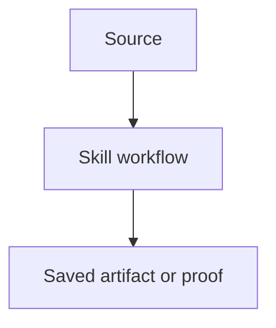

# Video Breakdown Template

Use this structure for the recurring YouTube explanation document requested after a skill is created or updated. This is the document saved under `docs/content/<topic>-video-breakdown.md`.

Trigger phrases for this template include:

- "create the YouTube document"
- "generate the YouTube artifact"
- "turn this into a YouTube explanation"
- "break this skill down for a video"
- "give me the video breakdown"

````markdown
# <Skill Display Name> Skill Video Breakdown

Draft notes for a Building The Age of AI video about the `<skill-name>` skill.

## Core Story

<One or two paragraphs explaining the failure and the skill's answer.>

Video hook:

> <Short hook line.>

## 1. What The Skill Does At A High Level

At a high level, the skill:

1. <step>
2. <step>
3. <step>

Short version for voiceover:

> <One sentence.>

## 2. Why It Is Necessary

<Failure mode, why naive agent behavior fails, what the skill prevents.>

Point for the video:

> <Memorable line.>

## 3. Why It Is Part Of Production AI

<How this skill supports proof, safety, quality, planning, operations, or the skill graph.>

Suggested phrasing:

> <Memorable line.>

## Components Provided By The Skill

| Component | What it provides | How it connects |
|---|---|---|
| <component> | <value> | <connection> |

## Skill Overview Visual



Narration:

1. <point>
2. <point>

## Bad Example Versus Good Example

Bad:

> <bad request/output>

Why it is bad:

- <reason>

Better:

> <better request/output>

The better version names:

- <attribute>

## How Other Skills Consume It

| Consumer | How it uses or depends on `<skill-name>` |
|---|---|
| `<other-skill>` | <relationship> |

## Suggested Video Structure

### 0. Opening

### 1. What The Skill Does

### 2. Why The Skill Exists

### 3. The Production AI Role

### 4. Component Walkthrough

### 5. Demo

### 6. Closing

## Suggested Titles

1. <title>
2. <title>
3. <title>

## Thumbnail Ideas

Option 1:

- <visual>
- Text: `<text>`

## Demo Outline

1. <step>
2. <step>
3. <step>

## Key Lines To Use

- "<line>"

## Short Description

<One paragraph.>
````

## Template Rules

- Keep headings stable so artifacts are easy to compare.
- Add diagrams when the skill has a graph, gate, pipeline, or safety boundary.
- Rename "Bad Example Versus Good Example" to a domain-specific heading when useful, for example "Bad Cleanup Versus Good Cleanup."
- Include titles and thumbnail ideas even for early drafts.
